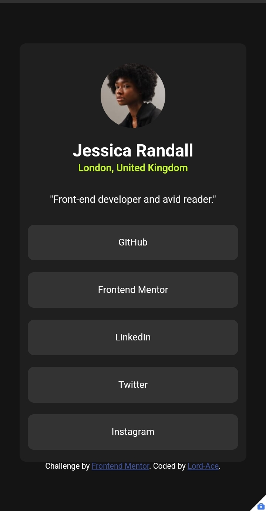
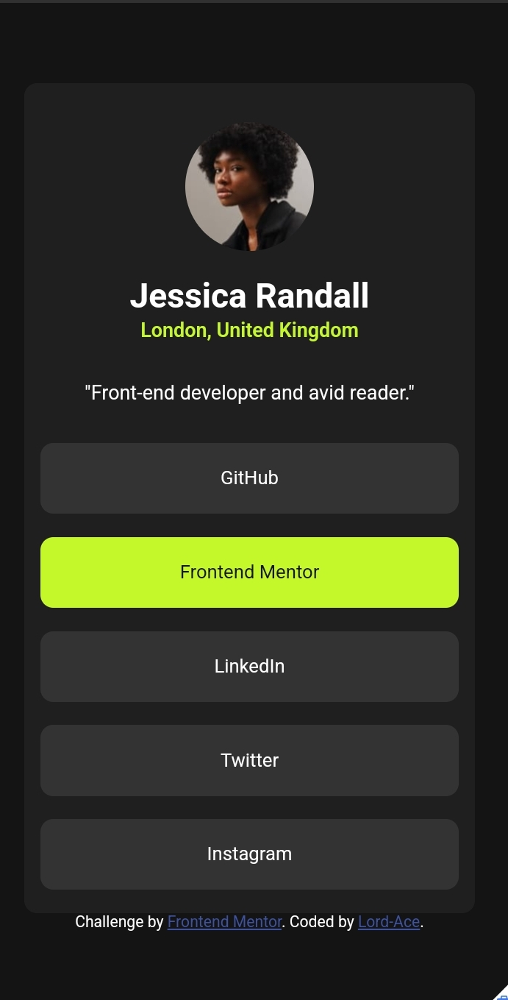

# Frontend Mentor - Social links profile solution

This is a solution to the [Social links profile challenge on Frontend Mentor](https://www.frontendmentor.io/challenges/social-links-profile-UG32l9m6dQ). Frontend Mentor challenges help you improve your coding skills by building realistic projects. 

## Table of contents

- [Overview](#overview)
  - [The challenge](#the-challenge)
  - [Screenshot](#screenshot)
  - [Links](#links)
- [My process](#my-process)
  - [Built with](#built-with)
  - [Continued development](#continued-development)
- [Author](#author)
- [Acknowledgments](#acknowledgments)

## Overview

### The challenge

Users should be able to:

- See hover and focus states for all interactive elements on the page

### Screenshot

### Links

- Solution URL: [label](./index.html)
- Live Site URL: [live site](https://social-links-profile-main-beige.vercel.app/)(https://social-links-profile-main-git-main-lordaces-projects.vercel.app/)
- 

## My process

### Built with

- Semantic HTML5 markup
- CSS custom properties
- Flexbox

### Continued development

i want to learn how to use css flexbox better and learn easier and better styling techniques so as to improve on my styling.

## Author

- github - [lord-Ace](https://www.github.com/lord-Ace)
- Frontend Mentor - [@lord-Ace](https://www.frontendmentor.io/profile/lord-Ace)

## Acknowledgments

I want to thank github community for their repositories and open source projects. They are and will always be really helpful

